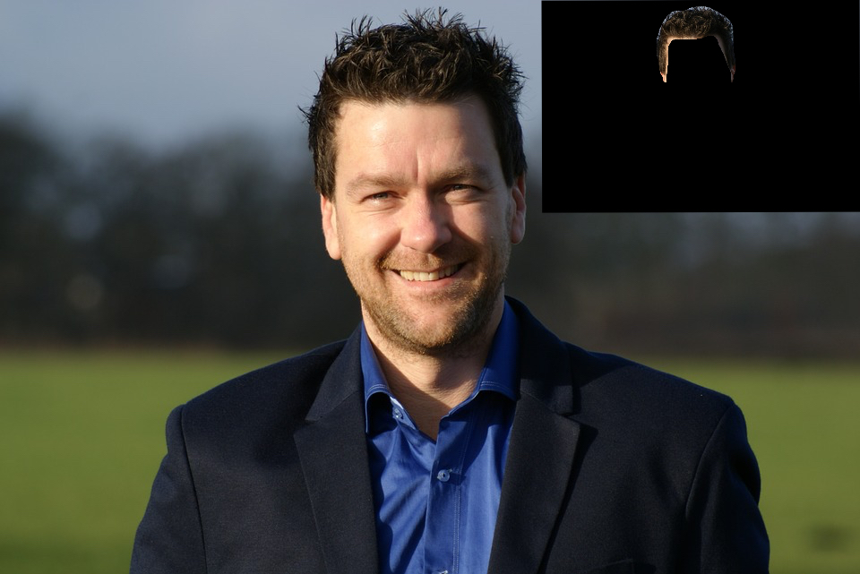

# Hair-Detection
Hair Mask RCNN using matterport model


## Set-Up
### Download requirments: </br>
```zsh
$ pip install -r requirements.txt
```
### Download and extract dataset and weights directly to repository folder: </br>
[Dataset](https://drive.google.com/file/d/1C-0foSYsKBh1bxp9XRIMXKUO6er4OqZc/view?usp=sharing)</br>
[Weights](https://drive.google.com/file/d/1ZbWTqWLi7w-lVvf7TQ59Gqil_SJnofbE/view?usp=sharing)</br></br>

#### Folder path should look like
.</br>
|</br>
|── dataset </br>
│&nbsp;&nbsp;&nbsp;&nbsp;&nbsp;&nbsp;&nbsp;&nbsp;&nbsp;&nbsp;&nbsp;&nbsp;&nbsp;&nbsp;&nbsp;|── train </br>
│&nbsp;&nbsp;&nbsp;&nbsp;&nbsp;&nbsp;&nbsp;&nbsp;&nbsp;&nbsp;&nbsp;&nbsp;&nbsp;&nbsp;&nbsp;|── val  </br>
|── mask_rcnn_hair_0200.h5</br>
|── run.py</br>
</br>
## Usage
### Training:</br>
To train run </br>
```zsh
$ python3 run.py train --dataset=path/to/dataset --weights=path/to/weights
```
For example to start training from the coco model</br>
```zsh
$ python3 run.py train --dataset=./data/dataset --weights=coco
```
Or to continue training from custom weights(for example project weights)</br>
```zsh
$ python3 run.py train --dataset=./data/dataset --weights=~/proj/Hair-Detection/data/weights/mask_rcnn_hair_0200.h5
```
### Run:</br>
Run this command on an image</br>
```zsh
$ python3 run.py mask --image=path/to/image --weights=path/to/weights
```
The image is saved into the project directory
## Dataset
[Figaro-1k](https://drive.google.com/file/d/1G7VWeIy2t0yM7bdOeFrf6Eqf6Z_aF0f-/view?usp=sharing): It contains 1050 unconstrained view images with persons, subdivided into seven different hairstyles classes (straight, wavy, curly, kinky, braids, dreadlocks, short), where each image is provided with the related manually segmented hair mask.  
